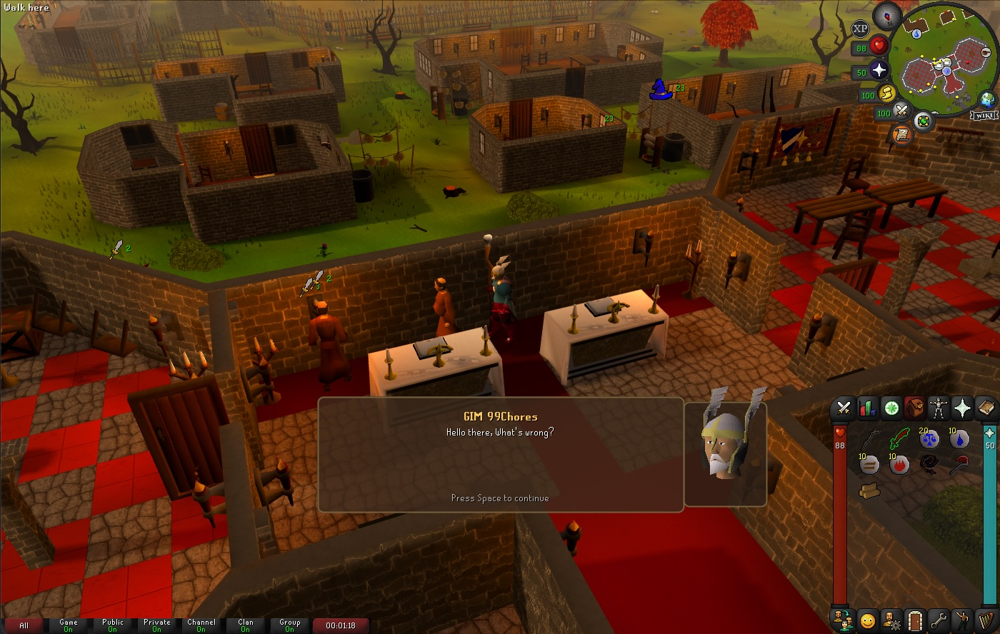
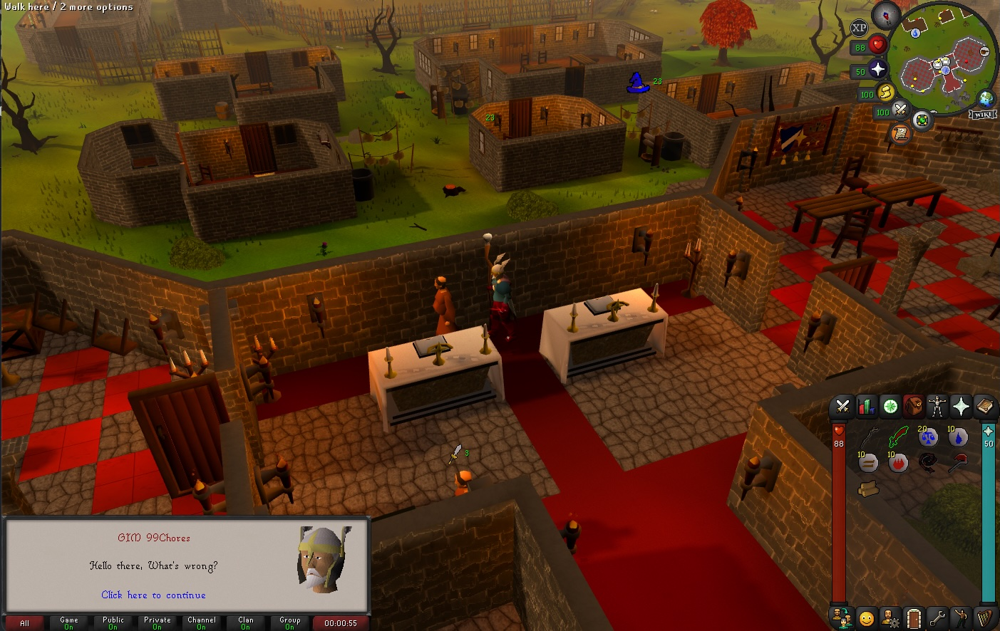
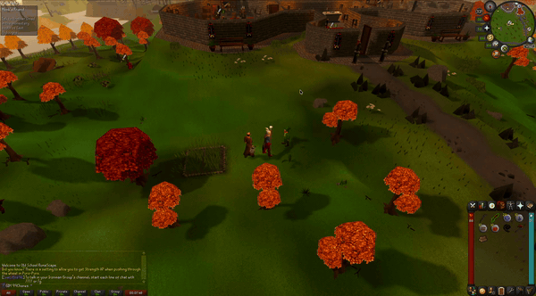
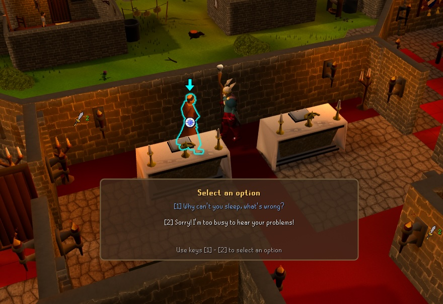
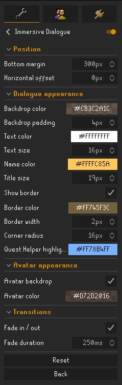

 

# Immersive Dialogue

Make Old School RuneScape conversations feel like a real RPG. Immersive Dialogue
lifts NPC and player dialogue out of the corner chatbox and into a new immersive
panel — with the **live, fully animated chat-head right beside it**.

## What it does

On large monitors the native chatbox is marooned in the bottom-left corner, far
from where the conversation is actually happening. Immersive Dialogue mirrors the
active conversation into a centered panel that sits where a modern RPG would put
it, and renders the speaker's animated head next to the text.

## What gets relocated

Every kind of chatbox dialogue is moved to the centered panel:

- **NPC dialogue** — the speaker's name, text, and live animated chat-head.
- **Your dialogue** — your own character's lines, with your chat-head.
- **Multiple-choice options** — each option is numbered so you can pick it with the
  matching number key.
- **System & quest message boxes** — the *"Click here to continue"* narration
  (e.g. *Hetty closes her eyes and begins to chant. The cauldron bubbles mysteriously.*),
  shown with no head.
- **Item "show" messages** — e.g. *You show the cup to Junior Jim.*, with the item's
  picture kept beside the text.
- **Level-up messages** — e.g. *Congratulations, you just advanced an Attack level.*,
  with the skill's celebratory model kept beside the text.

## The difference: a chat-head that isn't cut off

Look closely at the **native** OSRS chatbox and you'll notice the animated
chat-head is **clipped by the chatbox frame** — the top of the head and the
shoulders are sliced off at the panel edges. Immersive Dialogue re-renders that
same live, animated head on its own surface, so for the first time you see the
**whole** chat-head, uncropped.

| Native chatbox (head clipped at the frame) | Immersive Dialogue (head fully visible) |
| :---: | :---: |
|  |  |

## Showcase

> Prefer the full-quality clip? [Watch the showcase video](docs/immersive-dialogue-showcase.mp4).

## Quest Helper integration

If [Quest Helper](https://github.com/Zoinkwiz/quest-helper) is installed, the
option it marks as the correct quest choice is highlighted in the relocated
panel — in a legible color you choose under *Dialogue appearance*. Quest
Helper's own highlight color is used only to detect which option to mark.

## Interaction

The relocated dialogue is driven entirely by the keyboard, exactly like the native chatbox:

- **Spacebar** continues to the next line (the panel shows a *Press Space to continue* hint).
- **Number keys** select an option — each option is prefixed with the key that picks it
  (`[1]`, `[2]`, …), and the panel shows a *Use keys [1] - [N]* hint.
- **Esc** closes the dialogue (RuneLite's native "Escape closes interfaces").
- **Alt + drag** the panel to reposition it anywhere on screen when *Enable drag mode*
  is on (see below). The new spot is saved automatically.

## Customization

Every setting lives under **Immersive Dialogue** in the RuneLite config panel,
grouped into five sections.

### General
| Setting | What it does | Default |
| --- | --- | --- |
| **Animate head** | Play the talking head animation instead of a static head. | on |

### Position
| Setting | What it does | Default |
| --- | --- | --- |
| **Enable drag mode** | Hold **Alt** and drag the panel to reposition it; the new spot is saved into Bottom margin / Horizontal offset. | on |
| **Bottom margin** | Distance of the panel from the bottom edge of the screen (0–2160 px). | 150 |
| **Horizontal offset** | Shift the panel left (negative) or right (positive) from center (-1920–1920 px). | 0 |
| **Reset position** | Click to move the panel back to its default position; it clears itself straight after. | off |

### Dialogue appearance
| Setting | What it does | Default |
| --- | --- | --- |
| **Backdrop color** | Color and opacity of the translucent panel. | dark brown, translucent |
| **Backdrop padding** | Padding around the text inside the panel (0–64 px). | 4 |
| **Text color** | Body text and option color. | white |
| **Text size** | Body / option font size (12–28 px). | 16 |
| **Name color** | Speaker name color. | gold |
| **Title size** | Speaker-name / header font size (14–28 px). | 19 |
| **Show border** | Draw a framed border around the panel. | on |
| **Border color** | Color of the border. | brown |
| **Border width** | Border thickness (1–8 px). | 2 |
| **Corner radius** | Corner rounding; 0 = square corners (0–40 px). | 16 |
| **Quest Helper highlight color** | Color used to highlight the option Quest Helper marks correct. | light blue |

### Avatar appearance
| Setting | What it does | Default |
| --- | --- | --- |
| **Avatar backdrop** | Draw a colored panel behind the chat-head. | on |
| **Avatar color** | Color and opacity of that panel. | dark brown, translucent |

### Transitions
| Setting | What it does | Default |
| --- | --- | --- |
| **Fade in / out** | Fade the panel in when it opens and out when it closes. | on |
| **Fade duration** | How long the fade takes (250–1000 ms). | 150 |

## License

BSD 2-Clause — see [LICENSE](LICENSE).
